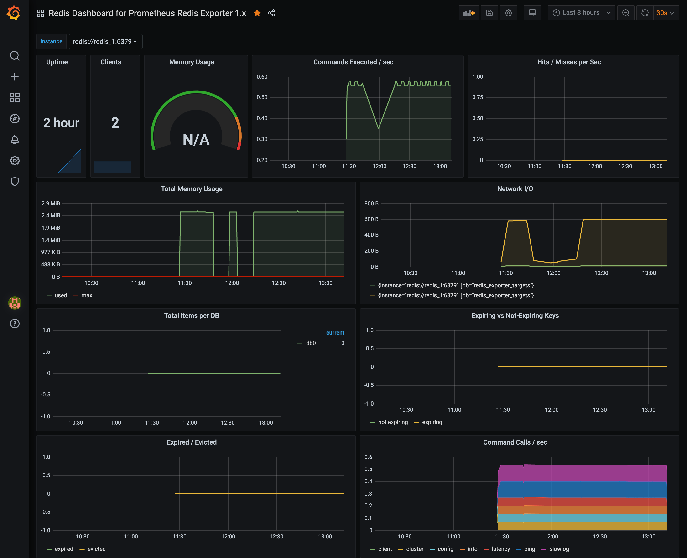

# Redis Cluster

This repo has various resources on redis cluster. If you are like me, and wants to cut BS as much as possible, please head to my blog post on Redis Cluster fundamentals, the official redis-cluster spec, and tutorial:

 - [Redis Cluster - Benefits of Sharding and How It Works](https://www.tugberkugurlu.com/archive/redis-cluster-benefits-of-sharding-and-how-it-works) (requires 🥃 )
 - [Redis Cluster Specification](https://redis.io/topics/cluster-spec) (requires 🍷 )
 - [Redis Cluster Tutorial](https://redis.io/topics/cluster-tutorial) (requires 💻 )

## Running Redis Cluster

You can run a Redis cluster locally with the help of Docker, which will help you create a deterministic environment. This repo comes with a pre-built setup to do just that, just run the following command to get up and running:

> ⚠️ Note that [the Redis Cluster doesn't support hostnames](https://github.com/redis/redis/issues/2565#issuecomment-99227165). Therefore, the each node needs to know the IP addresses of the other nodes within the cluster. In order to make this work deterministically, the setup inside this repo creates a network with a dedicated subnet of `172.19.197.1/24`, and assigns static IP addresses for the redis containers within this IP Address range. This ensures that nodes can connect between each other as well as ensuring that the Redis cluster nodes stay with the same (i.e. changing the IP address of a node will make Redis see that node as a new node).
>
> If this subnet is in use within your setup, or [you have changed the default Docker subnet](https://support.zenoss.com/hc/en-us/articles/203582809-How-to-Change-the-Default-Docker-Subnet), you need to change the following places accordingly to make the Redis clustering setup work properly:
>
> - Change the subnet of the network named `redis_cluster_network` inside the `./docker-compose.yml` file.
> - Change the `ipv4_address` value of the `redis_*` containers inside the `./docker-compose.yml` file, ensuring that each container gets a unique IP address within the new subnet range you have assigned.
> - Change the IP addresses listed inside the `./initializer/setup-cluster.sh` accordingly by matching them with the IP addresses you have assigned to each Redis container as part of the step above.

```bash
docker-compose up
```

### How Initializer Works

The initializer logic you can see under `./initializer` folder in this repository wires up the redis node together. It has the hardcoded list of
Redis node IP addresses. It:

 - makes sure all of them are up first by pinging. It keeps going till we have all nodes up
 - makes a `CLUSTER NODES` call to first node to get the IP addresses of all the configured nodes
 - takes the diff between our list of IP addresses and `CLUSTER NODES` output
 - adds the missing nodes to the cluster

### Connecting to the Redis Cluster with redis-cli

The `redis-cli` utility implements basic cluster support when started with the -c switch (e.g. performing )

```bash
docker run -it --rm \
    --net redis-cluster_redis_cluster_network \
    redis \
    redis-cli -c -h redis_1
```

#### Inspecting the Cluster

Redis provides bunch of subcommands that you can use with the `CLUSTER` command. As of `v5.0.3`, the list of those commands are as following:

```
redis_1:6379> CLUSTER HELP
 1) CLUSTER <subcommand> arg arg ... arg. Subcommands are:
 2) ADDSLOTS <slot> [slot ...] -- Assign slots to current node.
 3) BUMPEPOCH -- Advance the cluster config epoch.
 4) COUNT-failure-reports <node-id> -- Return number of failure reports for <node-id>.
 5) COUNTKEYSINSLOT <slot> - Return the number of keys in <slot>.
 6) DELSLOTS <slot> [slot ...] -- Delete slots information from current node.
 7) FAILOVER [force|takeover] -- Promote current replica node to being a master.
 8) FORGET <node-id> -- Remove a node from the cluster.
 9) GETKEYSINSLOT <slot> <count> -- Return key names stored by current node in a slot.
10) FLUSHSLOTS -- Delete current node own slots information.
11) INFO - Return onformation about the cluster.
12) KEYSLOT <key> -- Return the hash slot for <key>.
13) MEET <ip> <port> [bus-port] -- Connect nodes into a working cluster.
14) MYID -- Return the node id.
15) NODES -- Return cluster configuration seen by node. Output format:
16)     <id> <ip:port> <flags> <master> <pings> <pongs> <epoch> <link> <slot> ... <slot>
17) REPLICATE <node-id> -- Configure current node as replica to <node-id>.
18) RESET [hard|soft] -- Reset current node (default: soft).
19) SET-config-epoch <epoch> - Set config epoch of current node.
20) SETSLOT <slot> (importing|migrating|stable|node <node-id>) -- Set slot state.
21) REPLICAS <node-id> -- Return <node-id> replicas.
22) SLOTS -- Return information about slots range mappings. Each range is made of:
23)     start, end, master and replicas IP addresses, ports and ids
```

Let's check out one of the rudimentary ones: [`CLUSTER NODES`](https://redis.io/commands/cluster-nodes), which provides information about the nodes in our cluster (e.g. the current cluster configuration, given by the set of known nodes, the state of the connection we have with such nodes, their flags, properties and assigned slots, etc.):

```
redis_1:6379> cluster nodes
272613857b2ceb1d30c5f48c4c25836fb6350558 172.19.197.7:6379@16379 slave fe7614ba29ebca31b6a3d516db0095d17874f98c 0 1600976918106 6 connected
8e6d45810bef8253ed4ba4736a43f18756f0b559 172.19.197.2:6379@16379 myself,master - 0 1600976917000 1 connected 0-5460
fe7614ba29ebca31b6a3d516db0095d17874f98c 172.19.197.4:6379@16379 master - 0 1600976918512 3 connected 10923-16383
3959fb1b8ca1d5ef71ee12b01329d8aa14785ade 172.19.197.6:6379@16379 slave f21e37724ea99d411e7ae003f4f866f7257265aa 0 1600976918816 5 connected
a41e5b33bb6c05a7977010e8b07aab1d7f67b836 172.19.197.5:6379@16379 slave 8e6d45810bef8253ed4ba4736a43f18756f0b559 0 1600976918000 4 connected
f21e37724ea99d411e7ae003f4f866f7257265aa 172.19.197.3:6379@16379 master - 0 1600976917000 2 connected 5461-10922
```

### Connecting This Redis Cluster Setup to Your Own Applications

Once you get a Redis Cluster up and running through this setup, there are a few ways you can start integrating your own application with this Redis Cluster setup.

One way is to modify the content of this setup itself, by going into docker-compose file and adding your own docker definition there. This can work for cases where you want to get an example up and running quickly to test a few things out for example. However, it might not the best setup for your existing applications.

The other way is to copy the content of this setup into your own project, and keep it maintained there. This has advantages when it comes to having full autonomy over the configuration of the setup, but it also means that you need to maintain it, which means that you might be not be able to take advantage of the improvements made in this repo going forward easily (not promising there will be any but you never know 😀 ).

The third way is to keep this setup entirely separate, and connect your own docker container or `docker-compose` setup with the containers of this setup through the Docker network by defining [the pre-existing network](https://docs.docker.com/compose/networking/#use-a-pre-existing-network) on your own setup. For instance, this Redis cluster setup works within the defined `redis_cluster_network` network. Note that your app’s network is given a name based on the “project name”, which is based on the name of the directory it lives in. So, if you keep the directory name same as the repository name, this means the network name will be `redis-cluster_redis_cluster_network`. Inside the [./examples/basic-client](./examples/basic-client) example, you can see how this might work:

```yaml
version: "3"
services:
  redis_client_1:
    image: redis:5
    command: redis-cli -c -h redis_1 cluster nodes
    networks:
      - redis-cluster_redis_cluster_network
networks:
  redis-cluster_redis_cluster_network:
    external: true
```

Once we call `docker-compose up` under `./examples/basic-client` directory, we can see that it's able to connect to the cluster as expected:

```
➜  basic-client git:(master) docker-compose up
Recreating basic-client_redis_client_1_1 ... done
Attaching to basic-client_redis_client_1_1
redis_client_1_1  | 7f7bc05e136a5ef18280537bf2634b1480df586e 172.19.197.7:6379@16379 slave 68365ec85f6b26e9038d68b955050bf46cab85bc 0 1609176714000 6 connected
redis_client_1_1  | 216692211be53b512bc7f4801a463bc13ffcb74c 172.19.197.3:6379@16379 master - 0 1609176715121 2 connected 5461-10922
redis_client_1_1  | 7949a63252992188e0694c348803f63f78a27bd8 172.19.197.6:6379@16379 slave 216692211be53b512bc7f4801a463bc13ffcb74c 0 1609176715523 5 connected
redis_client_1_1  | e8d1375f647c649b1ade74ee6d258b35374992f7 172.19.197.2:6379@16379 myself,master - 0 1609176711000 1 connected 0-5460
redis_client_1_1  | 2ae44f4a40ecc6370425ca3e3c8c9c506f6c52ae 172.19.197.5:6379@16379 slave e8d1375f647c649b1ade74ee6d258b35374992f7 0 1609176715000 4 connected
redis_client_1_1  | 68365ec85f6b26e9038d68b955050bf46cab85bc 172.19.197.4:6379@16379 master - 0 1609176715000 3 connected 10923-16383
basic-client_redis_client_1_1 exited with code 0
```

> There are probably other ways to make this work. If you are aware of any other options, please feel free to send a pull-request.

## Prometheus Metrics and Grafana Visualization

`docker-compose up` also wires up the integration between Redis instances and Prometheus which allows us to collect metrics. This is achieved through [redis_exporter](https://github.com/oliver006/redis_exporter).

Besides Prometheus integration, `docker-compose up` also brings up a Grafana instance up and running, which you can further configure to visualize the data collected by prometheus so that we can have a better understanding on the impact of having a cluster setup while testing out a few scenarios locally. You can achieve this by following the steps below:

 - Navigate to `http://localhost:3000/`, and login. You should use `admin` for both username and password.
 - Add Prometheus as the data source by navigating to `http://localhost:3000/datasources`. You should use `http://prometheus:9090` as the URL of Prometheus instance.
 - You can navigate to `http://localhost:3000/dashboard/import` to import [a pre-configured Redis dashboard](https://grafana.com/grafana/dashboards/763). Type `763` as the dashboard id to import it.


Once you are done with these steps, you can now see the dashboard:



## Resources

 - [Monitoring Docker container metrics using cAdvisor](https://prometheus.io/docs/guides/cadvisor/)
 - [IPv4 Private Address Space and Filtering](https://www.arin.net/reference/research/statistics/address_filters/)
 - [How To Change The Default Docker Subnet](https://support.zenoss.com/hc/en-us/articles/203582809-How-to-Change-the-Default-Docker-Subnet)
 - [Communication between multiple docker-compose projects](https://stackoverflow.com/a/38089080/463785)
    - Also see "[Use a pre-existing network](https://docs.docker.com/compose/networking/#use-a-pre-existing-network)"
 - [Initializing Grafana with preconfigured dashboards](https://ops.tips/blog/initialize-grafana-with-preconfigured-dashboards/)
 - [Provisioning Grafana](https://grafana.com/docs/grafana/latest/administration/provisioning/)
